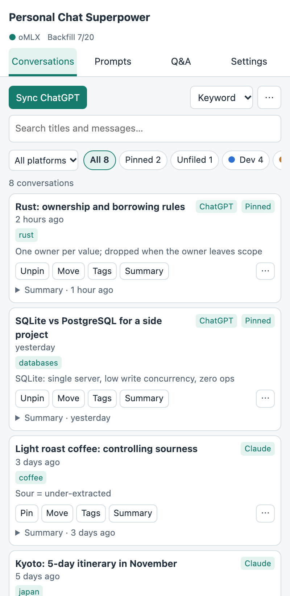
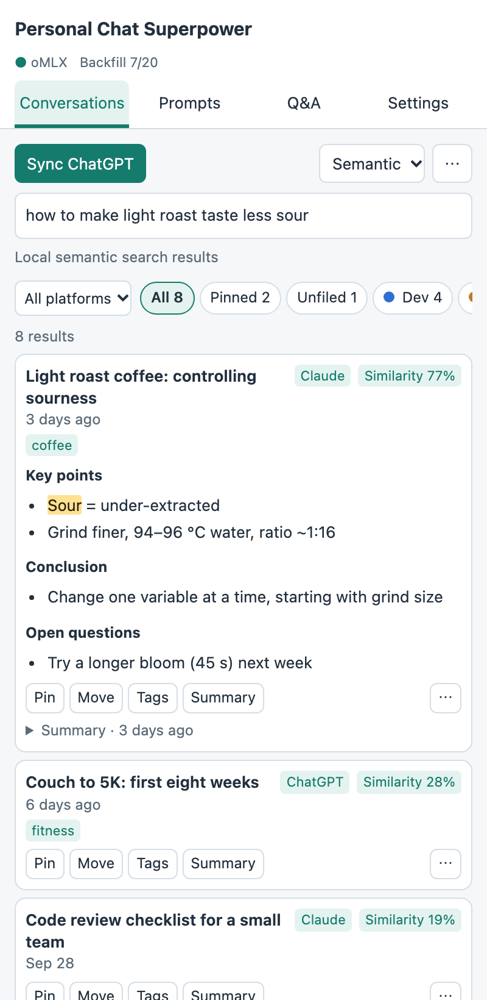
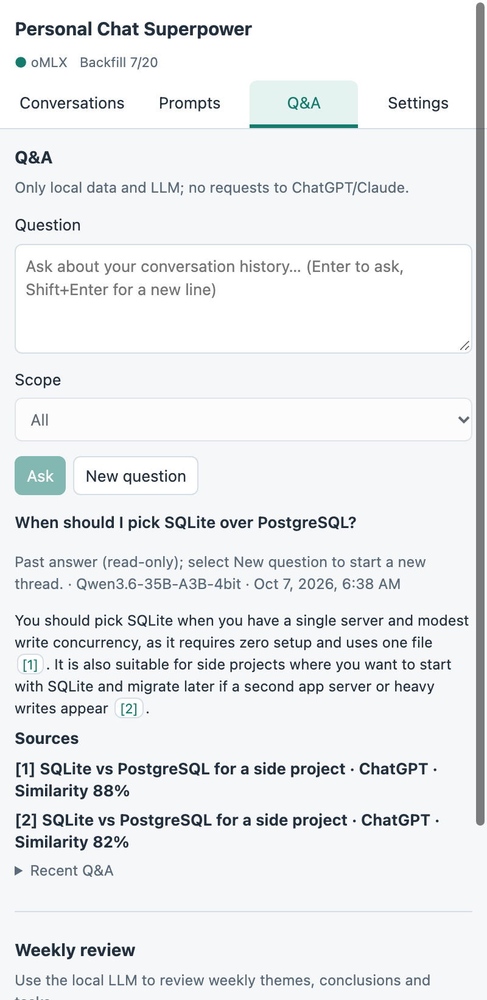
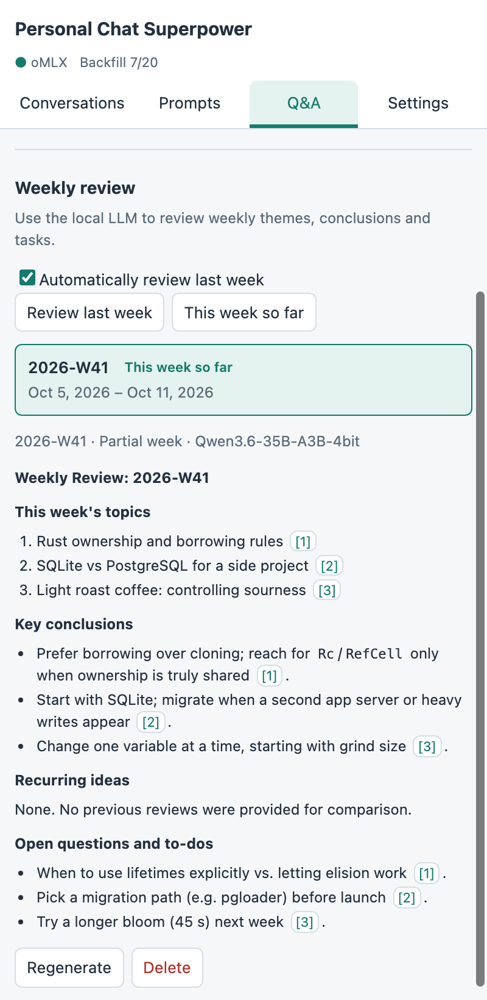

# Personal Chat Superpower

[English](README.md) · **繁體中文**

[](https://github.com/iks9245/personal-chat-superpower/actions/workflows/test.yml) [](https://github.com/iks9245/personal-chat-superpower/releases/latest)

**最簡單的安裝方式**：到 [Releases](https://github.com/iks9245/personal-chat-superpower/releases/latest) 下載最新的 zip 並解壓縮，在 `chrome://extensions` 開啟開發人員模式、按「載入未封裝項目」選擇該資料夾。出問題時請執行「設定 → 診斷」，複製報告後[回報 issue](https://github.com/iks9245/personal-chat-superpower/issues/new/choose)。

> 非官方專案，與 OpenAI、Anthropic 無關。擴充功能讀取的是 ChatGPT／Claude 網頁版的非公開介面，可能隨時失效；這類程式化存取可能違反相關服務條款，請自行評估風險後使用。

為 ChatGPT 與 Claude 加上本機對話資料夾、標籤、釘選、Prompt 庫、全文搜尋、本機對話問答（local RAG）、匯出、oMLX 本地 LLM 輔助與自選背景補摘要（v0.4.0）。使用 Manifest V3、純 JavaScript classic scripts；零第三方依賴、無建置步驟。預設繁體中文，可即時切換 English。

<table>
  <tr>
    <td align="center"><br><sub>資料夾、標籤、摘要</sub></td>
    <td align="center"><br><sub>語意搜尋</sub></td>
    <td align="center"><br><sub>附引用的問答</sub></td>
    <td align="center"><br><sub>每週回顧</sub></td>
  </tr>
</table>

<sub>截圖使用虛構的示範對話；搜尋排序、問答與每週回顧由本地模型實際產生。</sub>

## 安裝

1. 使用支援 Side Panel 的 Chrome 116 或更新版本。
2. 開啟 `chrome://extensions`，啟用右上角「開發人員模式」。
3. 點選「載入未封裝項目」（Load unpacked），選擇本目錄，也就是包含 `manifest.json` 的資料夾。
4. 開啟並登入 `https://chatgpt.com` 或 `https://claude.ai`。如果分頁已經開著，請重新整理一次，讓 content scripts 載入。
5. 將擴充功能釘選到工具列，點選圖示開啟側邊欄。側邊欄在 `chatgpt.com` 與 `claude.ai` 分頁啟用。

檔案修改後，在擴充功能管理頁按「重新載入」，再重新整理 ChatGPT 或 Claude 分頁。使用擴充功能本身不需要 Node；Node 只供執行測試或重新產生圖示。

## 使用

### 對話

- 按「同步 ChatGPT」或「同步 Claude」只讀取目前平台的標題清單，每頁 100 筆；每頁立即顯示並儲存。新項目沒有內文，已快取的內文會保留。同步固定使用啟動時的平台分頁，遇到短頁或空頁時停止，不依賴 API 的 total；只有 ChatGPT 且上一次同步完整跑完時，才會在整頁 updateTime 都相同時提早停止（取消或失敗後的下一次會完整翻頁）。Claude 的星號對話可能置頂，排序並非嚴格依更新時間，因此每次都翻到短頁或空頁。
- **同步永遠不下載對話內文。** 舊版批次抓內文曾觸發 ChatGPT 每帳號限流，導致 ChatGPT 頁面本身無法載入對話。現在改為標題同步、目前平台伺服器全文搜尋；除了手動診斷會讀取最多一筆內文且不快取，僅明確匯出、摘要單筆尚未快取的對話，或問答中點擊「下載相關內文後重答」時取得內文（每次最多 5 個同平台對話）。
- 預設請求開始時間至少相隔 1500ms，設定最少 1000ms。同步、搜尋翻頁、匯出、未快取的單筆摘要及明確確認的網站改名共用串行佇列。429 遵守 retryAfter，沒有時以 30 秒起指數退避，間隔逐次加倍，最多重試 4 次。取消立即停止等待與後續處理，保留已存快取；已送出的請求可能繼續至完成或 45 秒逾時，在它完成前不啟動下一個佇列請求。
- 輸入搜尋後 200ms 先顯示本機標題及已快取內文命中。trim 後至少 2 字、最多 200 字，且 active 分頁為 ChatGPT 或 Claude 時，約 700ms 後只呼叫一次該平台的伺服器搜尋 API；**查詢只傳送至目前平台（chatgpt.com 或 claude.ai）**。本機搜尋涵蓋全部平台的快取。首個搜尋請求不走同步佇列，最多一個搜尋在途，過期回應會丟棄。遠端命中依伺服器順序在前，接上本機獨有命中，重複時保留遠端片段。
- 搜尋框下方顯示來源或失敗原因，伺服器不可用時保留本機搜尋。ChatGPT 若有下一頁，按「載入更多」才抓一頁；Claude 搜尋 pagination token 的請求格式未驗證，因此不提供「載入更多」，不自動下載更多結果。遠端新命中會儲存為僅標題的記錄，可直接加標籤、移到資料夾或釘選。markdown snippet 視為純文字，跳脫後高亮。
- 本機搜尋英文不分大小寫，空白分隔的多個關鍵字採 AND，可跨標題與訊息；伺服器搜尋的匹配規則由各平台決定。
- 資料夾支援新增、改名、改色與刪除。刪除資料夾會將其對話移為未分類，不刪除對話快取。可篩選全部、未分類、已釘選或個別資料夾；清單上方另有「全部平台 / ChatGPT / Claude」篩選，會與資料夾篩選一起套用。
- 每筆對話有平台徽章。點標題會將目前分頁導向該對話的平台網址，可從任何分頁開啟。展開「操作」可移動、編輯標籤、釘選，或匯出 Markdown / JSON。
- 開啟多選模式後，可勾選或全選目前結果，批次移動或合併匯出一份檔案。切換篩選不會丟失已勾選項目；退出多選模式則清除選取。
- 單筆、批次及「匯出目前對話」：僅對與 active 分頁平台相同的對話，一次一筆取得最新內容並快取，顯示進度且可取消。超過 20 筆的批次下載會先確認筆數與預估時間（按請求間隔計算，遇限流會更久）。其他平台的對話只使用已快取內文；缺少內文時顯示「部分對話需要在 {platforms} 分頁中匯出。」並列出所需平台。下載前先檢查，不產生不完整檔案。大量匯出的確認筆數只計實際下載數。
- 「匯出目前對話」無須先同步；可選 Markdown 或 JSON。檔名使用 `標題_YYYY-MM-DD.md` 或 `.json`，會過濾非法字元。多筆 JSON 匯出為陣列。
- 匯出及本機快取內文只包含目前對話分支的 user / assistant 文字；伺服器搜尋結果範圍由各平台決定。ChatGPT 隱藏、system、tool 訊息不納入；Claude 排除 thinking、tool_use、tool_result，leaf 缺失才 fallback 依 index 排序全部訊息。Markdown 標題後會標示平台。圖片等非文字內容以 `[attachment]` 代替；不下載附件本體。

### Prompt 庫

- 新增或編輯標題、內容、標籤；以逗號分隔標籤。列表依使用次數、最後編輯時間排序，可搜尋與篩選標籤。
- 內容中的 `{{變數}}` 在插入前會顯示填寫表單；同名變數只填一次。插入成功後使用次數加一，不會自動送出訊息。
- 頁面中按 `Cmd/Ctrl + Shift + P` 開啟浮動選單，或在 ChatGPT 或 Claude 輸入框開頭輸入 `//`；選單開啟前會移除這兩個字元。
- 使用 ↑ / ↓ 選擇，Enter 插入，Esc 或點視窗外關閉。變數表單中 Enter 移至下一欄，最後一欄 Enter 插入。若作業系統或其他擴充功能攔截快捷鍵，可改用 `//`。
- 浮動選單使用 Shadow DOM 隔離樣式，與側邊欄一起跟隨系統深淺色模式；設定語言後兩處即時更新。

### 問答：詢問自己的對話紀錄

1. 在「設定 → 本地 LLM」選好對話模型及 Embedding 模型，再按「建立 / 更新語意索引」。已有舊索引也需要更新一次，建立新的內容段落索引。
2. 到 Prompt 與設定之間的「問答」分頁，選範圍：全部、目前平台、目前資料夾（沿用對話頁的資料夾／平台篩選）或已釘選。輸入問題後按「提問」或 Enter；Shift+Enter 換行，中文組字的 Enter 不會送出。
3. 回答逐步顯示 Markdown，句後 `[n]` 與下方「來源」都可點擊，在目前分頁開啟原對話。來源附平台、日期與相似度；涵蓋行顯示用了幾段、幾個對話，以及其中幾個只有標題。可直接追問，模型會看到這個討論串最近兩組問答；按「新問題」重設。

**提問不向 chatgpt.com／claude.ai 發出任何請求。** 只讀 IndexedDB 的本機段落，以一次本地 query embedding 檢索，再透過 SPC.llm 串流呼叫本地 oMLX。切入問答會取消尚未送出的關鍵字搜尋；已送出的舊請求仍可能完成，其晚到結果會丟棄。回答要求使用繁體中文、只根據提供的編號摘錄、引用 `[n]`，資料不足時直說，不用模型記憶補充事實。每次最多取 8 段、每個對話最多 3 段，cosine < 0.2 不採用；摘錄含標頭最多 12,000 字元，先裁切最低名次。小模型仍可能誤讀，重要內容可點來源核對。

**改善涵蓋範圍**：只有同步標題時，索引只能知道對話名稱。已儲存的本地摘要會加入第 0 段，已下載內文則切成約 800 字元、重疊 100 字元的段落。建立摘要或匯出內文後，重新更新索引。索引只使用快取，不自動抓取網站；模型與文字 hash 沒變就跳過 embedding，每批最多 32 段，會刪掉過時段落。設定統計新增「內容段落：… 段」，清除語意索引／對話快取都會清除段落。

若相關來源只有標題，且其中有目前分頁平台的對話，會顯示「下載相關內文後重答（… 筆）」。**只有明確點此按鈕才下載，每次最多 5 個對話，只限目前分頁平台**；超過 1 個先確認內文請求數與預估秒數。沿用匯出的串行佇列、至少 1000ms 間隔、429 退避、進度與取消，逐筆快取；網站 adapter 可能另需登入／組織查詢。下載後只更新這些對話的段落，再以原問題重答並替換最後回答。其他平台不會下載。共用「取消」可停止；已存內文保留。

問答與同步／匯出／索引互斥。討論串只存在目前側欄記憶體；「最近的問答」在 chrome.storage.local `qaHistory` 保存最近 20 筆完成的問題、回答、來源、模型及時間，可展開唯讀檢視、點引用開啟來源，或「清除問答紀錄」。問答紀錄及段落索引均不含於備份；匯入備份不改動問答紀錄。

### 匯出到 Obsidian

1. 到「設定 → 匯出到 Obsidian」，按「選擇 Vault 資料夾」，選擇現有的 Obsidian Vault。Chrome 可能要求讀寫授權；選擇會保存在本機，之後按「匯出 / 更新」即可再次使用。
2. 根資料夾預設為 `AI 對話`，可改為單一安全名稱（最多 80 字，不可包含路徑、前置點號或檔名／Obsidian 連結特殊字元）。只會在所選 Vault 的這個子目錄內寫入。
3. 選範圍：「已釘選或已分類」（預設，分類必須仍存在）、「全部」或「有摘要或內文」。按「匯出 / 更新」，頂部顯示進度並可取消；取消在檔案之間生效，已完成的檔案與紀錄保留。

每筆對話寫成 `<根資料夾>/<資料夾或未分類>/<標題>.md`，同名時加上平台及 ID 前六碼，仍重複則加序號。Markdown 含 YAML 屬性（標題、原標題 alias、平台、原對話網址、本地日期、資料夾、標籤、釘選及摘要模型）、已存摘要和已快取的對話。未下載內文會標示提示；不下載附件。根資料夾內另有 `索引.md`，依資料夾分組，連至本次範圍內的檔案。筆記採固定繁中章節名稱且不含匯出時間，切換介面語言不改變筆記內容。

**這項匯出對 chatgpt.com／claude.ai 發出零請求**，也不呼叫本地 LLM；只讀 IndexedDB／storage。與對話頁的 Markdown／JSON 匯出不同，這裡不補抓內文。

**保護使用者修改**：本機 manifest 記錄每次成功寫入的路徑與精確 UTF-8 bytes 雜湊。更新、搬移及索引更新前讀取現有檔案；若與上次寫入不符，顯示「已在 Obsidian 修改，略過」，完成報告可展開路徑清單。未登記的檔案一律視為外來檔案，改用同名後綴，不接管它們。只有改名／移動分類時，才在新檔案寫入後重新檢查並刪除未被修改的舊對話檔；移出匯出範圍、清除快取都不刪筆記。更換根資料夾會保留舊根目錄。完成報告的新增／更新／未變更／搬移計數只計對話；略過計數亦包含被修改的索引。

「忘記此資料夾」只清除本機的 handle 與 manifest，不刪 Vault 檔案；之後重新選取時，原有檔案會視為外來檔案並使用後綴。選另一個 Vault 也會重設 manifest。handle、manifest 及 Vault 偏好存於 IndexedDB，不含於備份，備份匯入不會改動它們。

**ZIP 退路**：若 `showDirectoryPicker` 不存在，或 Chrome 側欄／權限限制產生 `SecurityError`、`NotAllowedError`，會提供「改為下載 ZIP」。ZIP 為零依賴、不壓縮的 UTF-8 archive，包含相同範圍的 Markdown 與索引及根資料夾；解壓後自行放入 Vault。ZIP 不使用 manifest，也不替手動解壓提供覆寫保護。

Chrome Side Panel 中的 picker／持久權限可用性仍需在實際 Chrome 安裝中確認；自動測試使用假 handle，不能證明所有 Chrome 版本都能直接寫入。檔案系統 API 的「讀取檢查 → 寫入／刪除」不是跨 Obsidian 程序的原子交易，匯出時請避免同時編輯正在輸出的檔案。

Export to Obsidian uses only cached local data, with zero site or LLM requests. Choose a vault and a safe root folder, then export pinned/filed conversations, all conversations, or those with cached summaries/content. Notes include YAML, summaries, cached messages and a folder index. Modified files are skipped; foreign files get collision suffixes, and out-of-scope notes stay in place. Cancel stops between files. The saved handle and manifest are excluded from backups. If directory access is unavailable, use **Download ZIP instead** and extract it manually; ZIP extraction has no edit protection. Complete weekly reviews also export to `<root>/週報/<week>.md`, with deterministic source links and a weekly-review index section. Actual Chrome side-panel picker/permission support needs manual verification.

### 設定、備份與快取

- 語言：繁體中文 / English；請求間隔預設 1500ms，最少 1000ms。舊備份的較小設定仍可匯入，實際請求至少相隔 1000ms。
- 備份 JSON 包含 `settings`、`prompts`、`folders`、`convMeta` 及 `backfill.enabled/dailyLimit`，**不包含 IndexedDB 對話快取、段落索引、每週回顧或問答紀錄**。需要保留對話內容時，請另行多選匯出。
- 匯入先驗證資料格式，再確認「合併」或「覆蓋」。合併保留現有記錄，同 ID 採匯入資料；覆蓋取代上述設定與本地資料；背景補摘要的當日額度、失敗次數與暫停狀態不從備份還原，保留現值以免繞過安全限制。兩種模式都不變更對話快取。
- 清除快取需確認，清除 IndexedDB 對話內容、摘要、語意向量和內容段落，並重設最近同步時間，保留 Prompt、資料夾和對話標籤。
- 統計每個平台各顯示一行標題數、內文數（fetchedAt > 0）與最近同步時間。同步設定存於 `settings.sync.chatgpt` / `settings.sync.claude`，舊版 top-level 同步時間及完成旗標會在讀取時遷至 ChatGPT。增量同步不會刪除已從網站消失的歷史快取；需要完全重建時可先清除再同步。

## 每週回顧（本機限定）

「問答 → 每週回顧」可按「產生上週回顧」或「本週至今」。週次採本地 ISO 週：週一 00:00（含）至下週一 00:00（不含），例如 `2026-W41`；使用本機快取中該週更新的所有平台、所有對話，不受釘選／資料夾範圍限制。只傳標題、平台、分類、標籤與已有摘要給本地 LLM，不下載內文、不補摘要、不發網站請求。

輸入最多 20,000 字元，優先有摘要的項目，各組按更新時間降序，截短摘要或略過較舊項目。另比較緊接之前四週的完整回顧，每份最多 1,500 字元（同樣算入輸入預算）。輸出繁中「本週主題」「重要結論」「反覆出現的想法」「未解問題與待辦」，新想法標示「首次出現」，以 [n] 引用本週來源。清單由新到舊，可檢視 Markdown、點引用開啟對話、重新產生或刪除；生成串流顯示並支援全域取消。背景忙碌時稍後重試。

「自動產生上週回顧」預設啟用，獨立於背景補摘要開關。週一 06:00 本地時間之後，alarm 在不需網站請求、本地模型檢查通過且側欄不忙時產生缺少的上週回顧，共用背景租約避免重疊。失敗記錄於本地，隔日再試，每週最多三次；瀏覽器休眠可能延後，不補產生更早的週次。已存在或已刪除的回顧不自動重建。

回顧存於 IndexedDB `digests`（DB v5），**不在備份內，清除對話快取也保留**。「本週至今」標記 partial，不匯出；週結束後選取並「重新產生」可轉成完整週報。Obsidian 匯出及 ZIP 同時寫入完整回顧至 `<root>/週報/<week>.md`，並在 `索引.md` 的「週報」區由新到舊連結。來源連結由程式依實際匯出路徑產生；未匯出的來源顯示純文字，不讓 LLM 編造連結。週報沿用 manifest/hash 使用者修改保護，不覆寫手動編輯；從擴充功能刪除回顧不會刪除已匯出的 Vault 檔案。

Weekly reviews use only locally cached titles and summaries across all platforms, plus up to four preceding reviews; generation uses the local LLM and sends no site requests. Weeks run from local Monday midnight to the next Monday. Automatic last-week reviews default to enabled and run after Monday 06:00 when no site request is needed, even with backfill disabled, using the same lease. Failures retry on later days, at most three times per week. Saved reviews survive cache clearing and are excluded from backups; delete them individually. “This week so far” creates a partial review excluded from Obsidian export until regenerated after that week ends.

## 背景補摘要（自選啟用，刻意非常慢）

大部分同步記錄只有標題，問答、語意搜尋與標題建議因此缺少內容。到「設定 → 背景補摘要」勾選「啟用」才會開始；**預設關閉**。只處理已釘選或放在仍存在的資料夾、缺少摘要或摘要已過期、記錄失敗少於 3 次的本機對話。先補缺少摘要，再刷新過期摘要；各組先釘選，再依最近更新時間排序。過期定義為 `updateTime > summary.createdAt + 10 分鐘`；不會處理全部歷史記錄。

- Chrome 每分鐘觸發一次，最多一個網站 fetch。預設每天 20 筆，可設 1–100；以本機日曆日計數，午夜重設。**今日計數是網站請求嘗試額度**，送出前先記帳，即使本地生成失敗或背景程序中止也不退回，避免反覆下載。已完成總數另存於本機。
- 只選有開啟 ChatGPT／Claude 分頁的平台，不開新分頁。分頁最近 60 秒有鍵盤、指標按下或輸入，或側欄正在同步、匯出、生成、索引、問答、診斷時略過。已暫停或已達上限時略過網站工作。即使沒有摘要候選，每日仍可刷新清單。
- 每次先確認本地 URL／對話模型已設定，且本地 `/models` 成功回傳所選模型；LLM 不可用時**零網站請求**。下載後存完整內文，再用與「本地摘要」完全共用的 prompt／24,000 字元預算生成摘要。設定 Embedding 模型時，只更新該對話的向量與內容段落。
- **真正只有一個網站請求**：登入／組織查詢也受同一個 fetch 上限及每日額度約束，不刷新 token、不重試。若尚無記憶體 token／組織 cookie，該 tick 最多取得驗證資料，下一次 eligible tick 才可取得清單或內文；不會在同一 tick 再送一個網站請求。
- 每個有開啟分頁的平台，每個本地日先用一個 tick 嘗試刷新最新 100 筆標題（`spc:list { offset: 0, limit: 100 }`），保留已有內文、fetchedAt 與摘要。以 `lastListDay` 記下該日嘗試，失敗也不在當天重送清單，且計入每日上限；兩個平台分開占用 tick。
- 手動及背景摘要都儲存 `sourceHash = SPC.search.hash(SPC.summary.content(record))`。過期摘要下載內文後，若輸入 hash 相同，只保存新內文並將摘要時間更新為現在，**不呼叫 LLM**；hash 不同或舊摘要沒有 hash 才重新生成並更新索引。這比較的是共用 builder 的確切 24,000 字元輸入。
- 網站回 429、401 或 403 就停到下一個本地午夜，當天不能按「立即恢復」繞過。其他捕捉到的錯誤累積於該對話，3 次後跳過。LLM 探測失敗不累積對話失敗；LLM 自己的 401 不當成網站封鎖。

要停止後續下載，取消「啟用」，或按「暫停到明天」；手動暫停可按「立即恢復」。已發出的下載／本地生成仍可能完成。關閉對應平台分頁也會讓後續 tick 略過。統計包含範圍內總數、已有／缺少摘要、需更新筆數、今日額度及約需天數（（缺少數 + 需更新數）÷ 每日上限向上取整）；沒有開分頁、忙碌、限流、模型速度、失敗 3 次的記錄都會讓實際完成時間更長，估計不是承諾。

這個速度是刻意的：過去批次下載曾讓帳號被限流。每分鐘及每日上限只降低風險，不能保證網站永不限流。記憶體互斥加 `storage.session` 五分鐘租約避免重啟時重疊；進行中每 10 秒最多一次小型 session 心跳，延長租約並維持 worker 活動。Chrome 仍可因關閉瀏覽器、休眠或請求限制而中斷；租約到期後，仍缺少或過期的摘要可於額度允許時重試，中止本身不算捕捉到的失敗。心跳不能保證所有長生成存活，尤其 LLM 首個 fetch 回應超過 30 秒；見 [Chrome service worker lifecycle](https://developer.chrome.com/docs/extensions/develop/concepts/service-workers/lifecycle)。摘要已存但 embedding 失敗時可手動「建立／更新語意索引」補齊。

Background summary backfill is **off by default**. Enable it in Settings. It visits only pinned or filed conversations with missing or stale summaries (site update more than ten minutes after summary creation), at most one site fetch per minute and 20 attempts per local day by default (1–100 configurable). It requires an open matching site tab, idle site/panel, a reachable local chat model. Once per local day per open platform, one tick refreshes the latest 100 titles, preserving cached bodies and summaries. List and authentication requests share the same daily and single-fetch budget. Refreshes compare the exact summary-input sourceHash; unchanged content only updates the summary timestamp, without LLM generation. Site 429/401/403 stops it until local midnight with no early override. Turn off Enable or use Pause until tomorrow to stop future downloads. Slow progress is deliberate after a previous bulk-download rate limit; running work may finish, and browser shutdowns or long initial LLM responses can interrupt generation despite heartbeats.

## 出問題時

在 ChatGPT 或 Claude 分頁開啟側欄，到「設定 → 診斷」按「執行診斷」，再按「複製診斷報告」貼給開發者。複製權限不可用時會開啟可選取的報告文字框。每項顯示 ✅ 成功、❌ 失敗或 ⏭ 略過、耗時、可取得的 HTTP 錯誤狀態碼；失敗列附「可能需要修改」的檔案與函式。

| 檢查 | 代表什麼 |
|---|---|
| 擴充功能版本／啟用平台 | 目前擴充功能版本及 manifest 中註冊的 ChatGPT、Claude content scripts。 |
| content script | 側欄能否連線到分頁腳本；失敗時先重新整理網站分頁。 |
| session（ChatGPT） | 登入工作階段是否能提供 access token；401／403 通常需要重新登入。 |
| organization（Claude） | 能否從有效的組織 cookie 或組織清單找到聊天組織；cookie 路徑不發請求。 |
| list | 能否讀取一筆對話的清單；回應格式變動也會失敗。 |
| search | 固定以 `a` 測試搜尋端點，不使用你輸入的搜尋文字。 |
| conversation | 能否讀取清單第一筆的內文；清單失敗或為空時略過。結果不寫入快取。 |
| composer | 能否以目前的 DOM selectors 找到可見輸入框；不輸入或送出文字。 |
| models／chatModel／embeddingModel | 只列出本機 LLM 模型並檢查設定的模型是否存在；不生成對話或 embedding。 |
| 背景補摘要 | 只報告是否啟用、今日嘗試數與尚缺摘要數；不含 key、內容或失敗明細。 |
| 本機資料 | 各平台對話、已快取內文、目前 Embedding 模型的向量／段落、Prompt、資料夾數量；不連網。 |

診斷只在按下按鈕後執行，與同步／匯出等操作共用鎖。每次最多 **4 次網站請求**，逐次執行、相隔至少 **1000ms**，包括認證失敗也**不重試**。Claude 搜尋雖然使用 POST，但只讀取搜尋結果。**不測試改名，因為改名會寫入網站。** 頂部「取消」阻止後續檢查；已發出的請求可能仍需等到完成或逾時，結束後才釋放鎖。未完成的報告標記為部分結果。沒有支援的 active 分頁時略過網站檢查，仍可檢查本機資料。

報告只有固定檢查名稱、成功／失敗／略過、HTTP 狀態碼、錯誤類別、耗時、數量、版本、時間與固定修復位置，不包含對話標題、訊息、搜尋片段、任何對話／組織 ID、token、API key、cookie 值或本機服務 URL。UI 錯誤也使用固定的雙語訊息，不回顯伺服器內容。切換設定語言會立即更新結果標籤；報告保留穩定的檢查名稱與錯誤類別，方便開發者比對。

## 本地 LLM / oMLX（v0.3.0）

1. 在 Mac 啟動 oMLX app 的 OpenAI-compatible server；預設 Base URL 是 `http://127.0.0.1:11123/v1`。
2. 到擴充功能「設定 → 本地 LLM（oMLX）」，填入 Base URL 和 oMLX 的 API key。此機器已啟用 API key 驗證，所有本地 LLM 請求都帶 `Authorization: Bearer <apiKey>`。
3. 按「測試連線」讀取模型清單。對話模型選 Qwen3.x 等 chat 模型；Embedding 模型可選 `Qwen3-Embedding-0.6B`。介面預選名稱含 `embed` 的 Embedding 模型及不含 `embed` 的對話模型，再按「儲存」。
4. 「停用思考」預設勾選；若模型不支援該參數，會重試一次並在此工作階段記住。即使模型仍產生思考，`<think>…</think>`、尚未結束的 think 區塊與 `reasoning_content` 都不會顯示、存入摘要或拿來解析建議。串流有可見文字前顯示「思考中…」。

Chrome 連線請優先使用 `127.0.0.1` 或 `localhost`。`[::1]` 是有效且會被接受的本地 URL，但 Chromium 的 CSP host-source parser 尚不接受 IPv6 literal，因此目前可能被瀏覽器阻擋；此時可改用 `localhost`，不放寬為任意網路來源。參考 [Chromium CSP parser](https://chromium.googlesource.com/chromium/src/+/main/services/network/public/cpp/content_security_policy/content_security_policy.cc)。

- **本地摘要**：對話卡片「操作 → 本地摘要」。已有內文快取就直接使用；沒有時，須先開啟同平台分頁，只經既有 paced serial queue 下載該筆內文並快取。提供繁中「重點」「結論」「待辦／未解問題」摘要，輸入約 24,000 字元，超出時保留開頭與結尾。摘要逐步顯示於可展開區塊，完成後附模型及日期保存；可按「重新摘要」。共用「取消」可中止，未完成的摘要不儲存。已存摘要與串流草稿皆安全呈現 Markdown（標題、清單、程式碼、表格等），只建立 DOM 節點，不使用 `innerHTML`；原始 HTML 顯示為文字，連結僅允許 HTTP/HTTPS。
- **整理建議（標題・資料夾・標籤）**：多選時處理所選對話；否則處理目前篩選結果中未分類的對話。生成前可勾選「產生新標題／建議資料夾／建議標籤」，預設全開。每次最多 300 筆，有標題建議時每批 20 筆，否則每批 40 筆。只使用本機資料：目前顯示標題、已存摘要前 600 字；沒有摘要時，取已快取內文的前兩則 user 與首則 assistant（合計最多 800 字）；其餘只用標題。**產生過程不對 ChatGPT／Claude 發出任何請求，也不寫入資料夾或 convMeta**。壞掉的 JSON 批次會略過，全部批次失敗才報錯；過程可取消。
- **標題審閱與本機套用**：建議使用「主題：重點」，約 20 個中文字，保留專有名詞、產品及英文詞；只用標題的項目不能杜撰內容。分支有內容時描述差異，僅有標題時保留主題並加「（分支）」。審閱列顯示舊標題及「摘要／內文／僅標題」來源，可編輯新標題，資料夾新名稱標「新」。可全選／全不選，沒有任何所選種類建議的列不顯示。只有按「套用所選」才建立去重後的新資料夾、更新本機 `customTitle`、移動有資料夾建議的對話並合併標籤；關閉不寫入。卡片、搜尋、語意索引及匯出標題都使用本機顯示標題；本機關鍵字也比對網站標題及保存的原標題。修改標題後可重新建立語意索引。
- **可選網站同步**：每列「同步到 ChatGPT／Claude」預設關閉，只有新標題有效且與 active 分頁同平台才可勾選；「全部同步到網站」只切換可同步的列。套用時先完成本機變更，再確認同步筆數、約需時間及副作用：**網站更新時間會變為現在，這些對話會移到網站自身對話列表最上方**。確認後每個對話一個改名請求，沿用至少 1000ms 的 paced serial queue、429 退避及取消。成功後更新本機快取的網站標題，清除 `customTitle`，第一次成功改名才把之前的網站標題保存為 `originalTitle`；後續改名保留它。失敗保留本機標題，結果會列出成功、失敗與未處理筆數。取消不會回滾已成功的改名；已送出的請求仍可能完成，晚到回應不會寫入本機，必要時可重新同步網站標題。
- **手動編輯與還原**：卡片「編輯標題」只改本機顯示，留空清除 `customTitle`。自訂標題生效時，小字顯示「原標題：…」。有 `customTitle` 或 `originalTitle` 時顯示「還原原標題」：套用後清除本機覆寫；如果網站曾改名，會說明網站仍保留新標題，提供預設關閉的「同時把原標題同步回 {platform}」。勾選後仍須確認同樣的排序副作用，並走一次 paced 改名；成功才還原快取標題並清除 `originalTitle`。備份保存這兩個可選欄位（字串最多 200 字或 null）；合併舊備份缺少欄位時保留現有值，明確 null 則清除。
- **語意搜尋**：先在設定按「建立 / 更新語意索引」。索引涵蓋所有平台的本機記錄（僅標題的記錄也可），文字為標題、已存摘要與已快取訊息前 1,500 字元；絕不下載缺少的內文。每批最多 32 筆，逐批請求；相同模型與文字 hash 跳過，孤立向量刪除。設定顯示目前模型有效索引數，可取消或清除索引。搜尋框切換「語意」後，500ms 防抖，只嵌入查詢並用 cosine similarity 排序，依平台／資料夾／釘選篩選後顯示前 30 筆與相似度。Qwen3-Embedding 查詢加上 `Instruct: Given a search query, retrieve relevant chat conversations\nQuery: {query}`，文件不加前綴。切換模型後須建立該模型索引；無索引時提供設定連結。既有「關鍵字」模式保留網站搜尋行為。
- **Prompt 優化**：編輯 Prompt 時按「本地 LLM 優化」，改寫為更清楚的結構、保留原語言與每個 `{{variable}}` 原字樣／次數。尚未儲存時可「還原」；若模型改壞變數，拒絕使用結果。頁面 Prompt 選單按 Shift+Enter 或「✨」優化，接著如常填變數並插入，沒有自動送出訊息或覆寫 Prompt 庫。Esc 關閉等待，晚到結果不插入。

**隱私與限速保證**：只有主機恰為 `127.0.0.1`、`localhost` 或 `[::1]` 的 HTTP/HTTPS URL 可用；拒絕遠端、其他 IP、credentials、query/fragment 與重新導向。側邊欄直接呼叫本地端點，頁面 content script 只發 `spc:llm-optimize` 給 service worker，後者驗證 extension sender ID。API key 只持久儲存於 `chrome.storage.local`，以 password 欄位輸入，不顯示於狀態／log，不含於備份；合併及覆蓋匯入都保留現有 key。備份也不包含 IndexedDB 摘要、向量、內容段落或 qaHistory 問答紀錄。清除對話快取同時清除向量及內容段落；問答紀錄請在問答頁另外清除；每週回顧只可用各回顧的「刪除」按鈕移除。

這些 LLM 功能不會為提問、分類、索引、語意搜尋或 Prompt 優化向 ChatGPT／Claude 發出請求。摘要尚未快取的對話時，僅取得那一筆內文；另外，網站改名只在使用者勾選同步並確認後執行。問答的「下載相關內文後重答」則是另一個明確下載入口，最多 5 個同平台對話。這些網站操作均沿用既有串行限速、429 退避及取消規則；不自動預抓。oMLX 未啟動時顯示「無法連線到本地 LLM，請確認 oMLX 已啟動（{baseUrl}）」；401／403 提示檢查 API key，其餘 HTTP 錯誤包含狀態碼。chat 逾時 10 分鐘，embedding 每批 2 分鐘。

## 網站改名 API

- ChatGPT：`PATCH https://chatgpt.com/backend-api/conversation/{id}`，`Authorization: Bearer <token>`、`Content-Type: application/json`，body 僅 `{"title":"新標題"}`。2xx 必須帶 `{"success":true}` 才算成功。
- Claude：`PUT https://claude.ai/api/organizations/{org}/chat_conversations/{uuid}`，`content-type: application/json`，body **僅** `{"name":"新標題"}`（部分更新），202 回傳更新後的對話物件。使用 session cookie。
- 標題必須已 trim、長度 1–200、不含控制字元／換行；沿用既有 ID 驗證、同源 credentials、拒絕 redirect 與 45 秒 timeout。`spc:rename` 傳入 `{id,title}`，成功回 `{ok:true}`。兩個端點都會更新網站排序時間，確認前不呼叫。若原網站標題超過 200 字，會保留本機建議並拒絕同步，以免截斷還原資料。

## Claude 支援（v0.2.0）

Claude 使用登入 session cookie：content script 同源 fetch，`credentials: 'same-origin'`，不使用 Bearer token。請求拒絕重新導向並在 45 秒逾時；401/403 提示登入，429 的 status / Retry-After 交給既有串行限速佇列。沒有新增 adapter 重試、預抓或批量內文請求。

- 組織：優先使用 `document.cookie` 中 UUID 格式的 `lastActiveOrg`；否則 `GET /api/organizations`，選第一個 capabilities 包含 `chat` 的組織，略過只有 `api` 的組織；只在記憶體快取。
- 標題：`GET /api/organizations/{org}/chat_conversations?limit={limit}&offset={offset}`，回傳純陣列，uuid/name/created_at/updated_at 轉為共用格式。無 total，adapter 回傳 `offset + items.length + (items.length === limit ? 1 : 0)`。星號項目可能排在前面，因此 Claude **不在 unchanged page 提早停止**。
- 搜尋：`POST /api/organizations/{org}/conversation/search/v2`，header `{ 'content-type': 'application/json' }`、body `JSON.stringify({ query, n: 50, target_snippet_size: 200 })`。從 `data[].conversation` 與 `matched_snippet.text` 取結果；snippet 以純文字處理。雖然回應含 `next_page_token`，請求格式尚未驗證，因此固定回傳 `cursor: null`，**不提供搜尋翻頁**。
- 明確匯出、摘要尚未快取的單筆對話、問答的明確下載按鈕，或手動診斷（最多一筆、不快取）才呼叫 `GET /api/organizations/{org}/chat_conversations/{uuid}?tree=True&rendering_mode=messages&render_all_tools=true`。回應 `chat_messages` 包含所有分支；自 `current_leaf_message_uuid` 沿 parent 反向追蹤，根 parent 為 `00000000-0000-4000-8000-000000000000`。只匯出 human/assistant 文字，thinking/tools 排除；每個 file/attachment 以 `[attachment]` 佔位。
- 對話網址為 `https://claude.ai/chat/{uuid}`。composer selectors 依序是 `div.ProseMirror[data-testid="chat-input"]`、`[data-testid="chat-input"][contenteditable="true"]`、`div.ProseMirror[contenteditable="true"]`、`textarea#static-composer-input`；優先實際可見的 ProseMirror，不優先使用隱藏 static textarea。

## 隱私與權限

- 設定、Prompt、資料夾、標籤存於 `chrome.storage.local`；對話內容僅存擴充功能 origin 的 IndexedDB（`spc` v3 / `conversations`、`vectors`、`chunks`），不使用網站 origin 的資料庫，不使用雲端同步。
- 網站登入工作階段／組織查詢、標題列表、關鍵字全文搜尋及明確匯出只向 `https://chatgpt.com` 與 `https://claude.ai` 發出；關鍵字搜尋查詢只傳送至 active 平台。本地 LLM 只向指定的 loopback 端點發出請求。摘要未快取的單筆內文及使用者勾選並確認的網站改名沿用限速串行佇列。產生標題建議及提問不發網站請求；問答只在明確點擊下載按鈕時取得最多 5 個同平台對話內文。另可自選啟用上述保守的背景補摘要。無分析追蹤、第三方網路請求、遠端程式碼或外部字型；fetch 拒絕重新導向。ChatGPT access token 與 Claude organization ID 只保留在 content script 記憶體，從不寫入儲存或匯出。
- `storage` 儲存本機資料，`unlimitedStorage` 容納對話快取，`sidePanel` 顯示側邊欄，`alarms` 每分鐘喚醒背景補摘要檢查；主機權限包含 `https://chatgpt.com/*`、`https://claude.ai/*`，以及僅 `127.0.0.1`、`localhost`、`[::1]` 的 HTTP/HTTPS 本機端點（任意 port）。不需要 `tabs`、`downloads`、`scripting` 權限。
- 所有匯出使用本機 Blob 與 `<a download>`。匯出檔及備份可能包含私人內容，請自行保管。擴充功能資料不是加密保險箱；同一 Chrome 個人資料的使用者可存取本地檔案。
- 清除擴充功能資料或解除安裝可能移除本地記錄。不同帳號的資料會存在同一擴充功能快取；切換網站帳號前，可備份並清除快取以免混用。

## 檔案與開發

```text
manifest.json
src/shared/{ns,i18n,storage,db,platforms,conversation,prompt-vars,search,rag,markdown,llm,summary,backfill}.js
src/content/adapters/{chatgpt,claude}.js
src/content/{composer,prompt-palette,main}.js
src/background/service-worker.js
src/background/backfill.js      # 每分鐘背景摘要工作、每日額度與租約
src/sidepanel/{index.html,sidepanel.css}
src/sidepanel/core.js           # SPC.panel：狀態、共用 UI、限速佇列、操作鎖、編輯對話框與下載
src/sidepanel/conversations.js  # 資料夾、卡片、搜尋、標題編輯、同步、多選與匯出
src/sidepanel/local-llm.js      # 摘要、索引、LLM 設定與 Prompt 優化
src/sidepanel/suggestions.js    # 建議生成、審閱、套用與網站標題同步
src/sidepanel/prompts.js        # Prompt 庫、標籤篩選、編輯與插入
src/sidepanel/qa.js             # 問答、引用、歷史與下載內文後重答
src/sidepanel/digest.js         # 每週回顧清單、生成、引用與刪除
src/sidepanel/settings.js       # 語言、請求間隔、備份匯入、快取清除與統計
src/sidepanel/diagnostics.js    # 唯讀健康檢查與隱私安全報告
src/sidepanel/backfill.js       # 背景補摘要設定與即時統計
src/shared/vault.js             # 純 Markdown／路徑／匯出規劃及 STORE ZIP
src/sidepanel/vault.js          # Vault handle、檔案保護、設定與本機匯出
src/sidepanel/main.js           # 依原順序綁定事件與啟動
icons/{16,32,48,128}.png        # 由 icons/icon.svg（16px 用 icon-16.svg）轉出
tests/*.test.js
tests/index.js
package.json
README.md
```

共用模組採 UMD 風格，classic script 掛載至 `globalThis.SPC`，Node 可用 `require()`。側欄模組採 IIFE，共用 `SPC.panel`，在 shared scripts 後依上列順序載入（core 最先、main 最後），不需要依賴或建置步驟。測試涵蓋純函式、搜尋回應正規化、結果合併、高亮跳脫、備份驗證及雙語字典；另用模擬 Chrome、IndexedDB、fetch 與時鐘驗證 adapter、標題同步、搜尋防抖/過期回應、匯出、限速與取消，不連線到 ChatGPT、Claude 或實際 oMLX；LLM 測試使用 mocked fetch。

```sh
node --test tests/
node -e "JSON.parse(require('node:fs').readFileSync('manifest.json', 'utf8')); console.log('manifest OK')"
```

圖示原始檔為 `icons/icon.svg`（16px 另有筆畫加粗的 `icons/icon-16.svg`）；四種尺寸的 PNG 已包含在目錄內，修改 SVG 後需重新轉出 PNG。

## 規格補充與限制

1. content script 在 adapter 前載入 `platforms.js`、`conversation.js`、`composer.js`。側邊欄不載入 adapter，直接使用 `SPC.platforms[p].conversationUrl()`。共用 composer 保留可見候選優先、textarea 先 execCommand 後 setter、keydown `//` 偵測。
2. `settings.sync` 分平台保存 `{ lastSyncAt, titlesComplete }`；備份驗證僅複製格式正確的已知平台，忽略未知平台。舊對話沒有 platform 欄位時從 key 前綴推導。訊息格式為 `{ type, payload }`，錯誤為 `{ ok: false, error, status?, retryAfter? }`。
3. 額外加入備份純函式驗證與 i18n 測試，以及 `tests/index.js` 目錄入口，讓不同 Node 版本都能執行指定的 `node --test tests/`；不增加依賴、建置工具或權限。
4. ChatGPT `/backend-api` 為非公開 API；Claude `/api` 同樣非公開；端點、回應或 composer selectors 可能變更。網站相關抓取與 selectors 集中於 `src/content/adapters/{chatgpt,claude}.js`，共用輸入框編輯行為在 composer.js。ChatGPT 的 401 會清除 token 並重新取得一次；Claude 的 401/403 直接提示登入，不自動重試。
5. 單元測試不能證明 Chrome Side Panel、實際登入、API 權限或宿主編輯器的端到端相容性。安裝後請實測同步、取消、匯出、Prompt 插入、語言即時切換及備份還原。Chrome 的權限設計可能讓其他網站分頁 URL 為 `undefined`，介面會顯示「請在 ChatGPT 或 Claude 頁面使用」。
